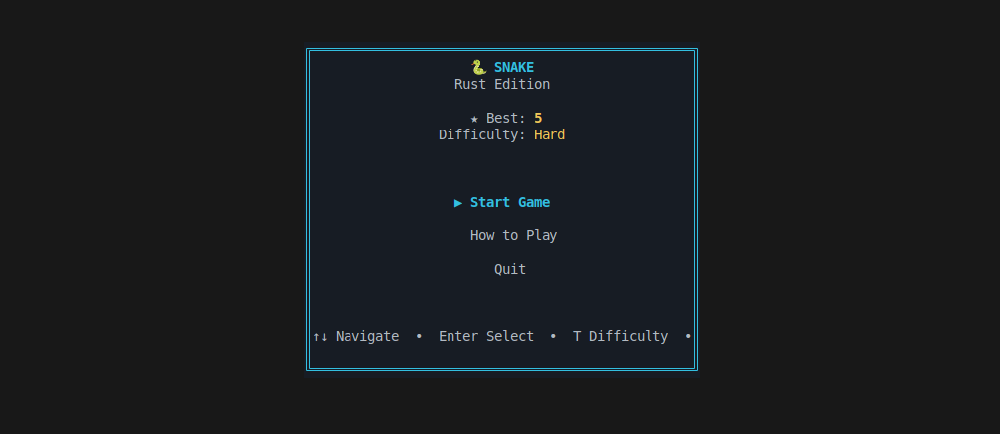
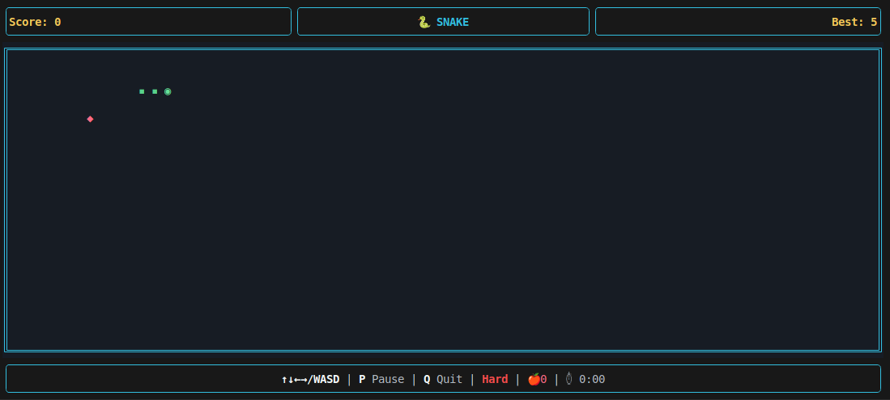

# 🐍 Snake Game

A modern terminal-based implementation of the classic Snake game, written in Rust.





## Features

- **Local 2-Player Split-Screen** - Compete with a friend on the same screen
- **Custom Themes** - Choose from multiple snake themes
- **Powerups & Obstacles** - Dynamic gameplay elements
- **Dynamic terminal resizing** - Game adapts to terminal size changes (including split-screen)
- **Multiple difficulty levels** - Easy, Medium, and Hard modes
- **Combo system** - Chain food pickups for bonus points
- **Persistent high scores** - Tracks your best performance
- **Modern UI** - Clean interface with ratatui and crossterm
- **Full keyboard navigation** - Arrow keys, WASD, and menu navigation

## Requirements

- Rust 1.70 or higher
- Terminal with Unicode support (recommended: 80x30 minimum)

## Installation

```bash
git clone https://github.com/Awungia112/snake_game.git
cd snake_game
cargo build --release
```

## Usage

```bash
cargo run --release
```

### Controls

**Menu Navigation:**
- `↑/↓` or `W/S` - Navigate options
- `Enter` or `Space` - Select
- `T` - Change difficulty
- `Q` - Quit

**In-Game (Single Player):**
- `↑/↓/←/→` or `WASD` - Move snake
- `P` - Pause
- `R` - Restart
- `Q` - Return to menu

**In-Game (2-Player Mode):**
- **Player 1:** `Arrow Keys` - Move
- **Player 2:** `WASD` - Move
- `P` - Pause both games
- `R` - Rematch (on Game Over)
- `Q` - Quit to menu

**Pause Menu:**
- `P` - Resume
- `Q` - Quit to menu

## Technical Stack

- **Language:** Rust (Edition 2021)
- **UI Framework:** [ratatui](https://github.com/ratatui-org/ratatui)
- **Terminal Backend:** [crossterm](https://github.com/crossterm-rs/crossterm)
- **Random Generation:** [rand](https://github.com/rust-random/rand)
- **Data Persistence:** serde + serde_json
